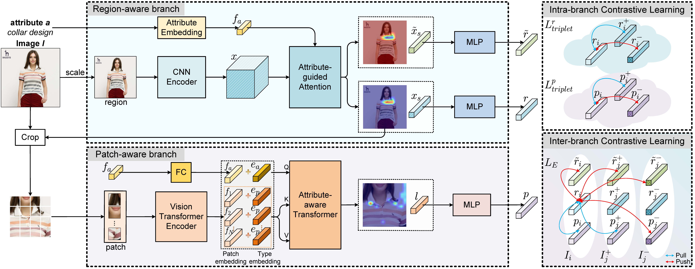

# From Region to Patch: Attribute-Aware Foreground-Background Contrastive Learning for Fine-Grained Fashion Retrieval




## Table of Contents

* [Environments](#environments)
* [Datasets](#datasets)
* [Configuration](#configuration)
* [Training](#training)
* [Evaluation](#evaluation)

## Environments
- **Ubuntu** 20.04
- **CUDA** 11.7
- **Python** 3.7

Install other required packages by
```sh
pip install -r requirements.txt
```

## Datasets
Following the previous work, we conduct experiments on three fashion related datasets, i.e., FashionAI, DARN, and DeepFashion. Please download them from the [URL](https://github.com/maryeon/asenpp#datasets) and put them in the corresponding folders.

### Configuration

The behavior of our codes is controlled by configuration files under the `config` directory. 

```sh
config
│── FashionAI
│   ├── FashionAI.yaml
│   ├── s1.yaml
│   └── s2.yaml
├── DARN
│   ├── DARN.yaml
│   ├── s1.yaml
│   └── s2.yaml
└── DeepFashion
    ├── DeepFashion.yaml
    ├── s1.yaml
    └── s2.yaml
```

Each dataset is configured by two types of configuration files. One is `<Dataset>.yaml` that specifies basic dataset information such as path to the training data and annotation files. The other two set some training options as needed.

If the above `data` directory is placed at the same level with `main.py`, no changes are needed to the configuration files. Otherwise, be sure to correctly configure relevant path to the data according to your working environment.

## Training

Download Google pre-trained ViT models for our Patch-aware Branch:
```bash
wget https://storage.googleapis.com/vit_models/imagenet21k/ViT-B_16.npz
```

RPF is trained in a two-stage way. For the first stage, we need to train the region-aware branch. Run the following script that uses default settings:

```python
python main.py --cfg config/<Dataset>/<Dataset>.yaml config/<Dataset>/s1.yaml
```

Based on the trained region-aware branch, the second stages jointly train the whole RPF:

```python
python main.py --cfg config/<Dataset>/<Dataset>.yaml config/<Dataset>/s2.yaml --resume runs/<Dataset>_s1/model_best.pth.tar
```

## Evaluation

Run the following script to test on the trained models:

```python
python main.py --cfg config/<Dataset>/<Dataset>.yaml config/<Dataset>/s2.yaml --resume runs/<Dataset>_s2/model_best.pth.tar --test TEST
```
